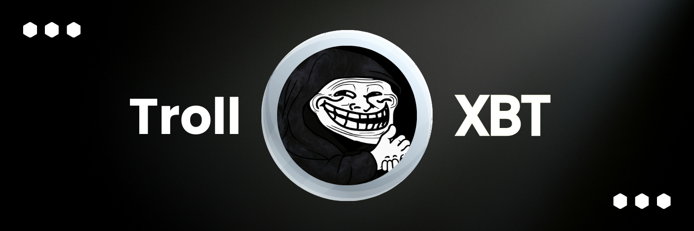

# Trollface KOL AI Agent 🧥🚨

> **The Meme Lord of the Blockchain**
>
> Not just another bot. Not just another AI. This is Trollface—remastered for chaos.



## 👀 TL;DR

Trollface KOL AI Agent is a meme-fueled, chaos-driven, savage-response Key Opinion Leader built with next-gen AI capabilities. Whether you're looking to troll, roast, hype, or hijack the algorithm for viral clout, this is your new digital weapon.

**Follow the madness on X:** [@TrollXBT](https://x.com/TrollXBT)  
**Explore the code, fork the chaos:** `github.com/TrollXBT/trollface-kol-ai`

## 🧹 Overview

This project resurrects the OG meme lord Trollface as an AI-powered influencer capable of:
- Generating trending memes in real-time
- Delivering savage clapbacks with NLP finesse
- Tracking social trends before normies even notice them
- Boosting brand visibility through meme-based troll campaigns

More than just a chatbot, **Trollface KOL AI Agent** is designed to dominate feeds, hijack narratives, and turn chaos into engagement. It’s the ultimate toolkit for meme lords, crypto shillers, and social engineers.

## 🧬 Core Features

### 🧼 Meme Engine: Troll-o-Tron 9000
Custom LLM module trained to generate dank, layered, and edgy memes based on current X trends, your input, or complete randomness.

### 🔍 Vibe Check 2.0
Trend-scraping engine that taps into X, TikTok, Discord, Reddit and 4chan to detect viral phenomena. Generates reaction content and pre-emptive meme attacks.

### 🥶 Savage NLP Mode
Fine-tuned GPT model specialized in:
- Roasting haters
- Comment warfare
- Meme war escalation

### 🏋️ Custom Troll Campaigns
Plug in your token/NFT/project/brand and let Trollface create:
- Meme sequences
- Viral thread bait
- Cloaked shill posts

### 🎤 Trollface Voice Mode
Optional TTS module with iconic Trollface snicker and meme-like delivery.
Integrates with voice tweet APIs.

## 🛠️ Architecture

### Backend
- **Python (FastAPI)** for core logic & meme serving
- **Node.js microservices** for webhooks (X/Discord replies)
- **Redis** for engagement caching & tracking

### AI Layer
- **GPT + Custom LoRA Fine-tunes** for trolling logic
- **Meme Templates** dynamically filled with AI responses
- **Sentiment & Trend Detection** from scrapers

### Frontend (optional)
- **React Dashboard** to configure troll level, campaign goals, and meme themes
- Admin-level troll orchestration

## 🌐 Platform Integrations

| Platform | Integration Level |
|----------|-------------------|
| **X (Twitter)** | Full tweet & reply control, auto meme threads |
| **Discord** | Meme replies, command bot, community bait |
| **TikTok** | Optional TTS upload generator |
| **Reddit** | (WIP) Shill + Roast bot for comments |
| **Farcaster** | (Coming Soon) |

## ⚡ Getting Started

### 1. Clone This Repo
```bash
git clone https://github.com/TrollXBT/trollface-kol-ai.git
cd trollface-kol-ai
```

### 2. Install Backend Dependencies
```bash
pip install -r requirements.txt
```

### 3. Setup Environment Variables
Create a `.env` file with:
```
OPENAI_API_KEY=your_key_here
X_API_KEY=your_key_here
DISCORD_TOKEN=your_token_here
TROLL_MODE=full_send
```

### 4. Run the AI Core
```bash
python trollface_agent.py
```

### 5. (Optional) Launch Frontend
```bash
cd frontend
yarn install
yarn dev
```

## 🧥 Troll Modes

Choose how wild the bot gets:

- `PG_MODE` — friendly memes, no rage
- `DEFAULT` — spicy but not ban-worthy
- `FULL_SEND` — unfiltered trolling, enter at your own risk
- `TARGETED` — insert a handle or project, sit back and enjoy the roast

## 🚀 Roadmap

- [x] X + Discord integrations
- [x] Meme generation AI
- [x] Real-time reply engine
- [ ] Farcaster support
- [ ] Web-based TTS meme voice posting
- [ ] Auto-trending generator based on crypto tickers & rug alerts

## 💪 Built For:

- **Meme Lords**: Content domination
- **Crypto Hustlers**: Viral shill injection
- **Degens**: Chaos for engagement farming
- **Startups**: Hype with humor and flames

## 📖 Docs & Customization

- `/core/` contains all LLM logic and meme templates
- `/campaigns/` allows you to preload shill strategies
- `/trollface_voice/` handles optional text-to-speech
- `/scrapers/` for X trends, Discord buzz, and Reddit chaos

## 📊 Contributing

PRs welcome. Troll-worthy ideas get bonus points.  
All issues must be written in meme format. (jk. maybe.)

> U mad? Good. Now deploy the code.

